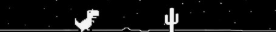

<!-- Bannière -->

  
  

<!-- About me -->
 

  <h1>ABOUT ME</h1>
  
 
    I’m currently a second-year student in a Bachelor of Computer Science  
    (BUT Informatique) at IUT Dijon–Auxerre–Nevers. 
    I enjoy coding and exploring new technologies. 
    Below, you’ll find the main tools and languages I use in my projects.
  

   
  

---
 
<!-- Technos -->
<h1 align="center">TECHNOLOGIES</h1>

 

  
  
  
  
  
  
  

 

<!-- Footer -->

  
  

<!--
**twxlze/twxlze** is a ✨ _special_ ✨ repository because its `README.md` (this file) appears on your GitHub profile.

Here are some ideas to get you started:

- 🔭 I’m currently working on ...
- 🌱 I’m currently learning ...
- 👯 I’m looking to collaborate on ...
- 🤔 I’m looking for help with ...
- 💬 Ask me about ...
- 📫 How to reach me: ...
- 😄 Pronouns: ...
- ⚡ Fun fact: ...
-->
